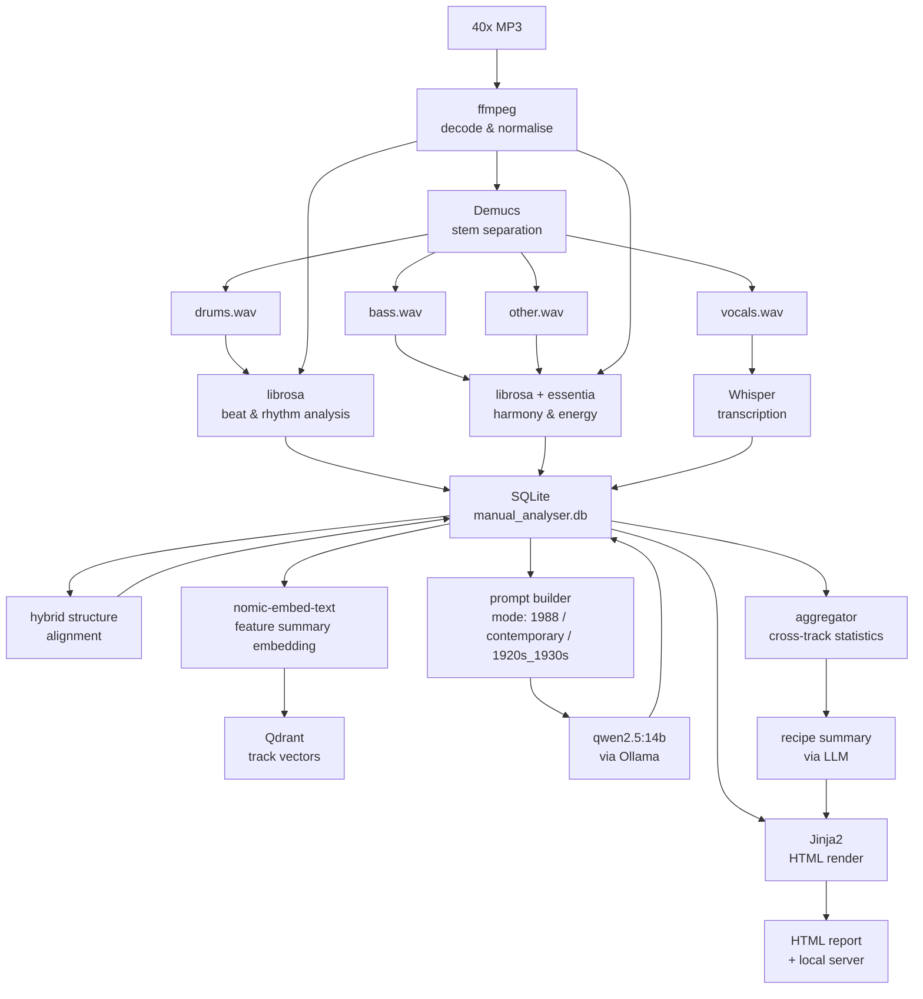

# KLF Manual Analyser

A command-line tool that analyses a set of songs against the hit-making criteria
described in *The Manual (How To Have A Number One The Easy Way)* by The KLF
(Bill Drummond and Jimmy Cauty, 1988).

Given a folder of MP3s, the tool extracts acoustic features, transcribes lyrics,
scores each track against The Manual's Golden Rules, and produces an interactive
HTML report. The aggregate view tells you what a song would need to look like to
match the majority of the tracks you gave it — effectively generating a personalised
addendum to The Manual based on your own input set.

---

## What it does

- Separates each track into stems (drums, bass, vocals, other) using Demucs
- Extracts tempo, beat pattern, song structure, energy profile, harmonic content,
  groove consistency, and danceability
- Transcribes lyrics from the vocals stem using Whisper, aligned to timestamps
- Cross-references lyric timestamps with energy and repetition data to produce
  a hybrid acoustic/semantic picture of song structure
- Scores each track per criterion using a local LLM (Ollama / qwen2.5:14b)
- Aggregates results across all tracks into a "recipe" for a matching song
- Renders a browsable HTML report served locally, with in-browser audio playback
  of the full mix and individual stems

Three modes are supported:

- **1988** — The Manual's original Golden Rules as written, calibrated to the UK
  singles market of the late 1980s
- **contemporary** — The same structural principles adapted to current streaming-era
  pop conventions
- **1920s_1930s** — Period-appropriate criteria for early jazz and dance band
  recordings, useful for validating the tool against the public domain test fixtures

---

## Pipeline overview



---

## Requirements

- Python 3.11+
- [uv](https://github.com/astral-sh/uv) (recommended) or pip
- [ffmpeg](https://ffmpeg.org/) on your PATH
- [Ollama](https://ollama.com/) running locally with `qwen2.5:14b` and
  `nomic-embed-text` pulled
- [Qdrant](https://qdrant.tech/) running locally (Docker or native)
- A CUDA-capable GPU is strongly recommended for Demucs and Whisper (CPU will
  work but is significantly slower)

---

## Installation

```bash
git clone https://github.com/your-handle/klf-manual-analyser
cd klf-manual-analyser
uv sync
```

Pull the required Ollama models if you haven't already:

```bash
ollama pull qwen2.5:14b
ollama pull nomic-embed-text
```

Start Qdrant (if using Docker):

```bash
docker run -p 6333:6333 qdrant/qdrant
```

---

## File naming convention

MP3s must follow the format:

```
Artist_Name-Song_Title.mp3
```

Underscores separate words within the artist name or song title; the hyphen
separates artist from title. Examples:

```
The_KLF-Doctorin_The_Tardis.mp3
Stock_Aitken_Waterman-Never_Gonna_Give_You_Up.mp3
Louis_Armstrong-Heebie_Jeebies.mp3
```

The tool parses artist and song title from the filename at ingest. No other
metadata source is used.

---

## Usage

### Analyse a folder of MP3s

```bash
uv run manual-analyser analyse ./my-tracks --mode 1988
uv run manual-analyser analyse ./my-tracks --mode contemporary
uv run manual-analyser analyse ./my-tracks --mode 1920s_1930s
```

Progress is displayed in the terminal as each stage completes. All extracted
features, scores, and transcripts are stored in `data/manual_analyser.db`.
Stems are cached as WAV files in `data/stems/` and not re-generated on
subsequent runs unless `--no-cache` is passed.

### Render or re-render the HTML report

```bash
uv run manual-analyser report --mode 1988
```

Re-renders from the database without re-running any analysis.

### Browse the report

```bash
uv run manual-analyser serve
```

Starts a local server at `http://localhost:8000`. Open in any browser.
Not intended for deployment — local use only.

### Clear the cache

```bash
uv run manual-analyser clean --stems        # remove WAV stems only
uv run manual-analyser clean --features     # remove DB records for all tracks
uv run manual-analyser clean --reports      # remove rendered HTML
uv run manual-analyser clean               # remove everything
```

---

## Configuration

Criteria for each mode live in `config/`:

```
config/
  criteria_1988.toml
  criteria_contemporary.toml
  criteria_1920s_1930s.toml
```

Each file defines the criteria, their weights, the database fields they map to,
and whether scoring is deterministic (threshold comparison) or qualitative (LLM).
You can edit these files to adjust thresholds, add criteria, or create entirely
new modes without touching any code.

See `docs/DESIGN.md` and `docs/DATA_MODELS.md` for full documentation.

---

## Test fixtures

The `tests/fixtures/` directory contains a curated set of public domain recordings
from the 1920s–1930s sourced from the Internet Archive and Open Music Archive,
used for unit testing the analysis modules. See `tests/fixtures/SOURCES.md` for
full attribution. These recordings also serve as a demonstration dataset for the
`1920s_1930s` mode.

---

## Caveats

- Structural segmentation combines acoustic heuristics with timestamp-aligned
  lyric data. This is an approximation; accuracy varies with recording quality.
- Lyric transcription quality depends on Whisper accuracy, which varies with
  vocal clarity. Whisper's performance on 1920s recordings with heavy surface
  noise will be notably lower than on modern recordings.
- This tool is for educational and analytical purposes. All analysis is performed
  locally. No audio data leaves your machine.

---

## Licence

MIT. See `LICENSES/MIT.txt`.

Third-party dependency licences are listed in `LICENSES/`. Model weight terms:
Whisper (MIT), Demucs htdemucs (MIT), qwen2.5 (Qwen Licence — permits
non-commercial and research/educational use; users agree to terms when running
`ollama pull qwen2.5:14b`), nomic-embed-text (Apache 2.0).

---

## Background

*The Manual* was published in 1988 following The KLF's UK number one single
*Doctorin' the Tardis*. It is a step-by-step, occasionally tongue-in-cheek guide
to achieving a number one hit with no money and no musical ability. Its Golden
Rules — a consistent dance groove, a specific song structure, a BPM ceiling, an
irresistible chorus — are a surprisingly rigorous piece of pop theory, and have
been cited as genuinely influential on subsequent hit-makers.

This tool treats The Manual as a specification and asks whether a given set of
songs meets it.