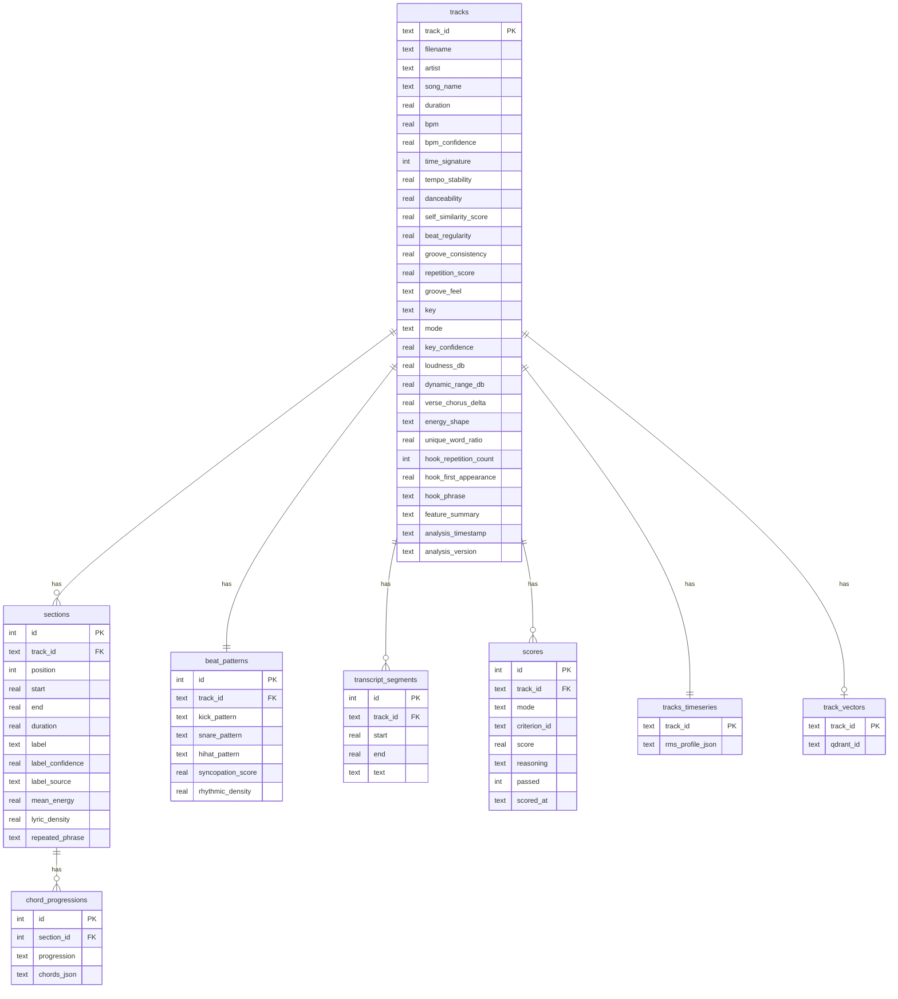
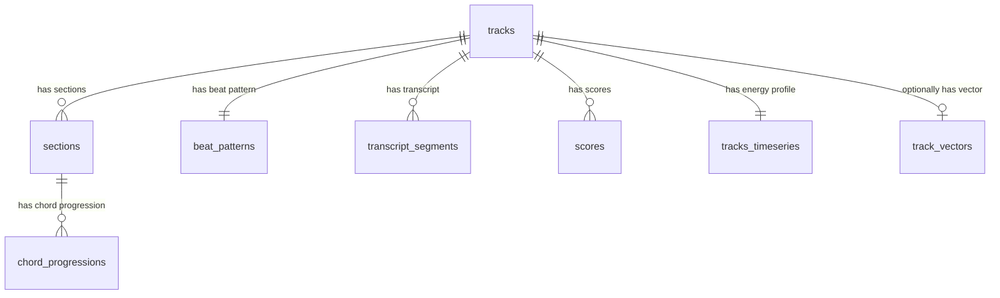
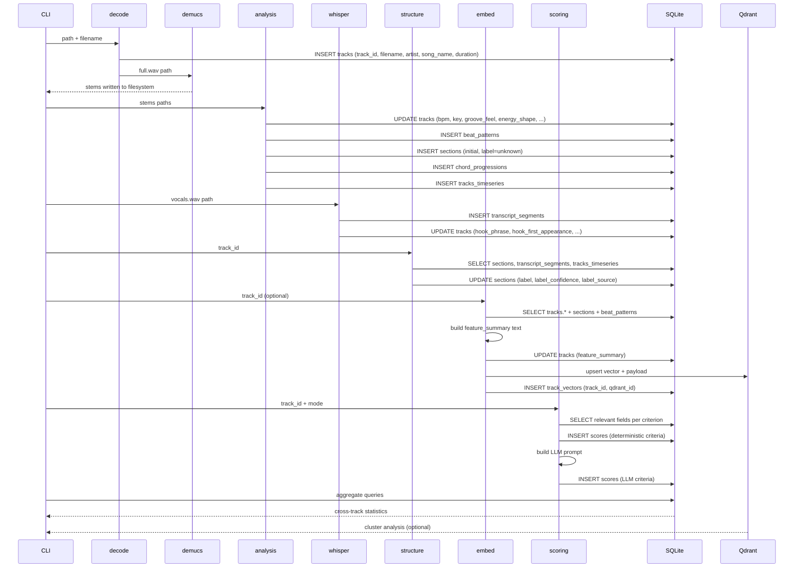

# Data Models

KLF Manual Analyser — SQLite schema, Qdrant collection spec, and data flow.

This document is the authoritative reference for the shape of all persisted data.
All feature extraction modules and the scoring layer write to and read from the
structures defined here.

---

## Table of Contents

1. [Overview](#overview)
2. [SQLite schema](#sqlite-schema)
3. [Entity relationships](#entity-relationships)
4. [Field reference](#field-reference)
5. [Qdrant collection](#qdrant-collection)
6. [Filesystem layout](#filesystem-layout)
7. [Data flow by stage](#data-flow-by-stage)
8. [Conventions](#conventions)

---

## Overview

All structured data lives in a single SQLite database at `data/manual_analyser.db`.
Track similarity vectors live in a Qdrant collection at `localhost:6333` —
**Qdrant is optional**; if unavailable, the embedding stage is skipped and all
other functionality continues normally.
Stem WAV files live on the filesystem under `data/stems/`.



Note: `tracks ||--o| track_vectors` is zero-or-one (optional), reflecting that
the embedding stage may not have run.

---

## SQLite schema

### `tracks`

One row per MP3 file. Scalar features and metadata. Written at ingest (filename
parsing) and updated progressively as analysis stages complete.

```sql
CREATE TABLE tracks (
    -- identity
    track_id            TEXT PRIMARY KEY,   -- MD5 of path+filename
    filename            TEXT NOT NULL,
    artist              TEXT,               -- null if filename non-conformant
    song_name           TEXT,               -- null if filename non-conformant

    -- timing
    duration            REAL NOT NULL,      -- seconds

    -- tempo (tempo.py)
    bpm                 REAL,               -- beats per minute (physical unit)
    bpm_confidence      REAL,               -- 0.0–1.0
    time_signature      INTEGER,            -- 3 or 4
    tempo_stability     REAL,               -- 0.0–1.0; 1.0 = perfectly metronomic

    -- groove (groove.py)
    danceability        REAL,               -- 0.0–1.0 (essentia)
    self_similarity_score REAL,             -- 0.0–1.0
    beat_regularity     REAL,               -- 0.0–1.0
    groove_consistency  REAL,               -- composite: beat_regularity * self_similarity
    repetition_score    REAL,               -- 0.0–1.0; chroma-based

    -- rhythm feel (rhythm.py)
    groove_feel         TEXT,               -- "straight" | "swung" | "unclear"

    -- harmony (harmony.py)
    key                 TEXT,               -- e.g. "C", "F#"
    mode                TEXT,               -- "major" | "minor"
    key_confidence      REAL,               -- 0.0–1.0

    -- energy (energy.py)
    loudness_db         REAL,               -- normalised 0.0–1.0 (from LUFS range)
    dynamic_range_db    REAL,               -- normalised 0.0–1.0
    verse_chorus_delta  REAL,               -- normalised 0.0–1.0; energy difference
                                            -- between verse and chorus sections
                                            -- (0.15 ≈ 3dB, 0.30 ≈ 6dB)
    energy_shape        TEXT,               -- "building" | "flat" | "peaked" | "unclear"

    -- lyrics / hook (whisper.py)
    unique_word_ratio   REAL,               -- 0.0–1.0; low = more repetitive
    hook_repetition_count INTEGER,
    hook_first_appearance REAL,             -- seconds (physical unit)
    hook_phrase         TEXT,               -- most repeated phrase

    -- embedding
    feature_summary     TEXT,               -- human-readable summary sent to embedder

    -- metadata
    analysis_timestamp  TEXT NOT NULL,      -- ISO 8601
    analysis_version    TEXT NOT NULL       -- semver of tool
);
```

**Note on `verse_chorus_delta`**: this field is normalised 0.0–1.0 despite its
name suggesting dB units. The normalisation is `raw_db / 20.0` (capped at 1.0),
so 0.15 ≈ 3dB and 0.30 ≈ 6dB. The CRITERIA.md threshold of 0.15 for the
`chorus_energy` criterion therefore corresponds to a ~3dB lift.

---

### `sections`

One row per detected section per track. Written by `structure.py` after the
hybrid alignment pass.

```sql
CREATE TABLE sections (
    id              INTEGER PRIMARY KEY AUTOINCREMENT,
    track_id        TEXT NOT NULL REFERENCES tracks(track_id),
    position        INTEGER NOT NULL,       -- 0-indexed order within track

    -- timing
    start           REAL NOT NULL,          -- seconds (physical unit)
    end             REAL NOT NULL,          -- seconds (physical unit)
    duration        REAL NOT NULL,          -- seconds (physical unit)

    -- label
    label           TEXT NOT NULL,
        -- "intro" | "verse" | "pre_chorus" | "chorus" | "breakdown"
        -- | "double_chorus" | "bridge" | "outro" | "unknown"
    label_confidence REAL NOT NULL,         -- 0.0–1.0
    label_source    TEXT NOT NULL,
        -- "acoustic"  — derived from energy/segmentation alone
        -- "lyric"     — derived from transcript repetition alone
        -- "hybrid"    — agreement between acoustic and lyric signals

    -- content
    mean_energy     REAL,                   -- normalised 0.0–1.0
    lyric_density   REAL,                   -- words per second, normalised 0.0–1.0
    repeated_phrase TEXT                    -- most repeated phrase in segment, or null
);
```

---

### `chord_progressions`

One row per section. The progression field is a compact human-readable string;
`chords_json` holds the full timed sequence for report rendering.

```sql
CREATE TABLE chord_progressions (
    id              INTEGER PRIMARY KEY AUTOINCREMENT,
    section_id      INTEGER NOT NULL REFERENCES sections(id),
    progression     TEXT NOT NULL,          -- e.g. "Am - G - F - C"
    chords_json     TEXT NOT NULL
        -- JSON array of {start: float, end: float, chord: str}
        -- stored as blob; only ever read as a unit
        -- accuracy: ~70-75% on modern recordings, lower on 1920s material
);
```

---

### `beat_patterns`

One row per track. The 16-step patterns are stored as 16-character binary strings
for readability and direct rendering as grids in the report.

```sql
CREATE TABLE beat_patterns (
    id              INTEGER PRIMARY KEY AUTOINCREMENT,
    track_id        TEXT NOT NULL REFERENCES tracks(track_id),

    -- 16-step binary strings, modal bar pattern
    -- "1" = hit, "0" = rest, 16th-note resolution
    -- e.g. four-on-the-floor kick: "1000100010001000"
    kick_pattern    TEXT NOT NULL,          -- 16 chars
    snare_pattern   TEXT NOT NULL,          -- 16 chars
    hihat_pattern   TEXT NOT NULL,          -- 16 chars

    syncopation_score   REAL,               -- 0.0–1.0
    rhythmic_density    REAL                -- 0.0–1.0
);
```

---

### `transcript_segments`

One row per Whisper segment. Typically 2–8 words, 1–4 seconds per segment.

```sql
CREATE TABLE transcript_segments (
    id          INTEGER PRIMARY KEY AUTOINCREMENT,
    track_id    TEXT NOT NULL REFERENCES tracks(track_id),
    start       REAL NOT NULL,              -- seconds (physical unit)
    end         REAL NOT NULL,              -- seconds (physical unit)
    text        TEXT NOT NULL
);
```

---

### `scores`

One row per criterion per mode per track.

```sql
CREATE TABLE scores (
    id              INTEGER PRIMARY KEY AUTOINCREMENT,
    track_id        TEXT NOT NULL REFERENCES tracks(track_id),
    mode            TEXT NOT NULL,          -- "1988" | "contemporary" | "1920s_1930s"
    criterion_id    TEXT NOT NULL,          -- matches id field in criteria TOML
    score           REAL NOT NULL,          -- 0.0–1.0 (normalised from 0–10 LLM output)
    reasoning       TEXT,                   -- LLM explanation; null for deterministic rules
    passed          INTEGER NOT NULL,       -- 1 | 0 (SQLite boolean)
    scored_at       TEXT NOT NULL           -- ISO 8601
);

CREATE INDEX idx_scores_track_mode ON scores(track_id, mode);
CREATE INDEX idx_scores_mode_criterion ON scores(mode, criterion_id);
```

---

### `tracks_timeseries`

One row per track. JSON blob of RMS energy values sampled every 0.5 seconds.

```sql
CREATE TABLE tracks_timeseries (
    track_id        TEXT PRIMARY KEY REFERENCES tracks(track_id),
    rms_profile_json TEXT NOT NULL
        -- JSON array of floats, 0.0–1.0, one per 0.5s interval
        -- ~360 values for a 3-minute track
);
```

---

### `track_vectors`

Maps `track_id` to the Qdrant point ID. Absent if embedding stage was skipped.

```sql
CREATE TABLE track_vectors (
    track_id    TEXT PRIMARY KEY REFERENCES tracks(track_id),
    qdrant_id   TEXT NOT NULL               -- UUID string
);
```

---

## Entity relationships



---

## Field reference

### Normalised vs physical units

Fields are stored in physical units where the value is used in direct threshold
comparisons or displayed to the user:

| Field | Unit | Notes |
|---|---|---|
| `bpm` | beats per minute | Used in `lte 135` threshold directly |
| `duration` | seconds | Used in `lte 210` threshold directly |
| `start`, `end` | seconds | Timing data |
| `hook_first_appearance` | seconds | Used in `lte 30` threshold directly |

All other numeric feature fields are normalised to 0.0–1.0:

| Field | Raw range | Normalisation |
|---|---|---|
| `loudness_db` | -60 to 0 dBFS | `(value + 60) / 60` |
| `dynamic_range_db` | 0 to 60 dB | `value / 60` |
| `verse_chorus_delta` | 0 to 20 dB | `value / 20` |
| `mean_energy` | 0 to 1 RMS | already normalised by librosa |
| `lyric_density` | 0 to ~5 words/sec | `min(value / 5, 1.0)` |
| `rhythmic_density` | 0 to 4 onsets/beat | `min(value / 4, 1.0)` |

### Section labels

Valid values for `sections.label`:

| Label | Description |
|---|---|
| `intro` | Pre-vocal or pre-groove opening section |
| `verse` | Narrative lyric section, typically lower energy than chorus |
| `pre_chorus` | Build section before chorus; increases tension |
| `chorus` | Hook section; highest lyric repetition |
| `breakdown` | Low-energy mid-track section; Manual-specific |
| `double_chorus` | High-energy chorus repetition post-breakdown |
| `bridge` | Contrasting section; rare in Manual-era pop |
| `outro` | Closing section |
| `unknown` | Could not be labelled with confidence > 0.3 |

### `groove_feel`

| Value | Description |
|---|---|
| `straight` | Beats fall on the grid; no swing |
| `swung` | Off-beats delayed; jazz, shuffle, or funk feel |
| `unclear` | Insufficient confidence to classify |

Detection: ratio of even to odd 8th-note subdivisions in the beat grid.
Swing ratio > 0.55 → `swung`. Below 0.52 → `straight`. Between 0.52–0.55 →
`unclear`. (0.5 = perfectly straight, 0.67 = full triplet swing.)

### `energy_shape`

| Value | Description |
|---|---|
| `building` | Energy increases progressively through the track |
| `flat` | Consistent energy throughout |
| `peaked` | Energy peaks in the middle section |
| `unclear` | No clear pattern |

---

## Qdrant collection

**Optional** — all queries guarded by availability check.

**Collection name**: `tracks`
**Vector size**: 384 (nomic-embed-text output dimension)
**Distance metric**: Cosine

### Point structure

```json
{
  "id": "uuid-string",
  "vector": [0.12, -0.34, "..."],
  "payload": {
    "track_id": "md5-hash",
    "artist": "The KLF",
    "song_name": "Doctorin The Tardis",
    "bpm": 126.4,
    "key": "C",
    "mode": "major",
    "groove_feel": "straight",
    "mode_scores": {
      "1988": 0.82,
      "contemporary": 0.61
    }
  }
}
```

Note: `bpm` in the Qdrant payload is the raw physical value (not normalised),
consistent with the SQLite `tracks.bpm` field.

### Queries used by the aggregator

- **Cluster analysis**: group tracks into natural clusters; label by dominant payload features
- **Nearest neighbours**: for each track, find the 3 most similar tracks in the set
- **Filtered search**: find tracks matching a payload filter sorted by similarity

All Qdrant queries are wrapped in try/except; if Qdrant is unavailable the
aggregator proceeds without similarity data and the report omits those features.

---

## Filesystem layout

```
data/
├── manual_analyser.db
├── stems/
│   └── {track_id}/             -- MD5 hex digest of path+filename
│       ├── full.wav
│       ├── drums.wav
│       ├── bass.wav
│       ├── vocals.wav
│       └── other.wav
└── reports/
    └── {mode}_{timestamp}.html
```

Stems are not tracked in the database — their existence is inferred from the
filesystem. The caching layer checks for the four stem files directly.

---

## Data flow by stage



---

## Conventions

- **Primary keys**: `tracks.track_id` is a 32-character MD5 hex string. All
  other tables use `INTEGER PRIMARY KEY AUTOINCREMENT`.
- **Booleans**: stored as `INTEGER`, values `0` or `1`.
- **Timestamps**: stored as `TEXT` in ISO 8601 format.
- **Null handling**: fields written by later stages are nullable. Scoring prompts
  handle nulls explicitly (treat as missing data, not zero).
- **JSON blobs**: used only for `chords_json` and `rms_profile_json`. Never for
  data queried field-by-field.
- **Versioning**: `analysis_version` records the tool semver. Migrations in
  `db.py` handle schema upgrades.
- **Physical vs normalised**: `bpm`, `duration`, `start`, `end`, and
  `hook_first_appearance` are stored in physical units. Everything else
  normalised 0.0–1.0. See Field reference above.
