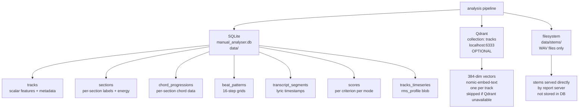
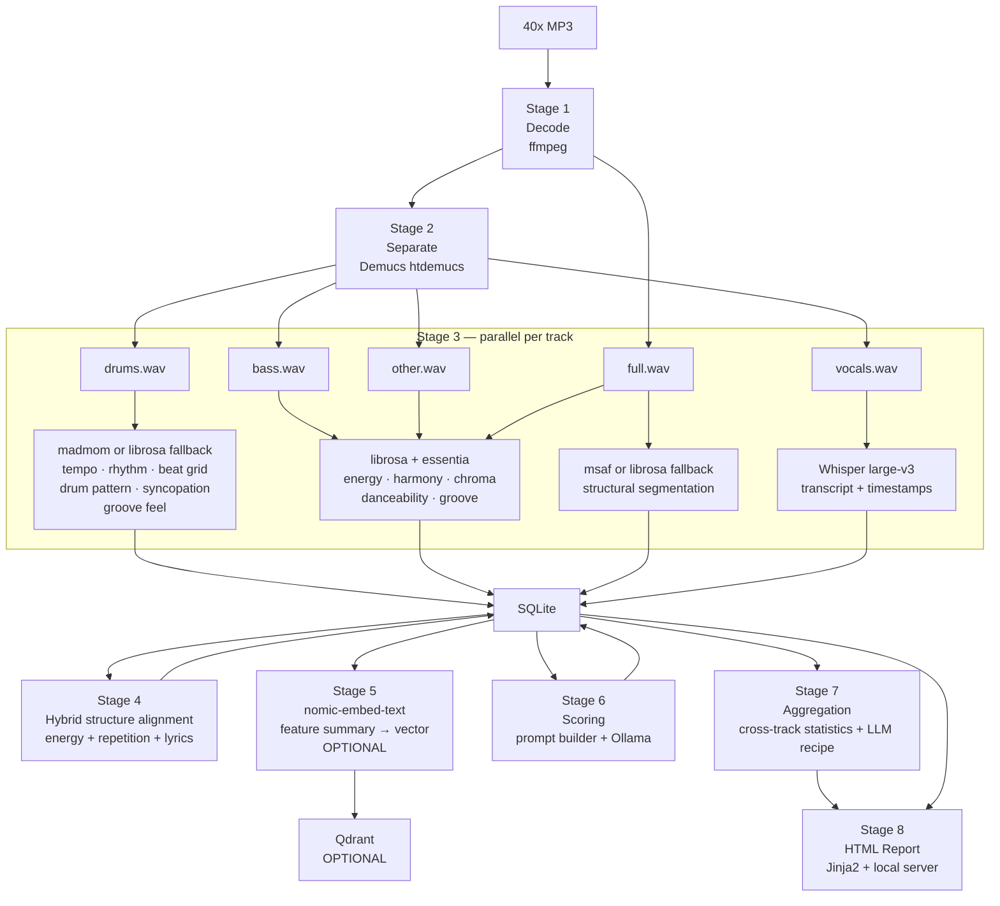
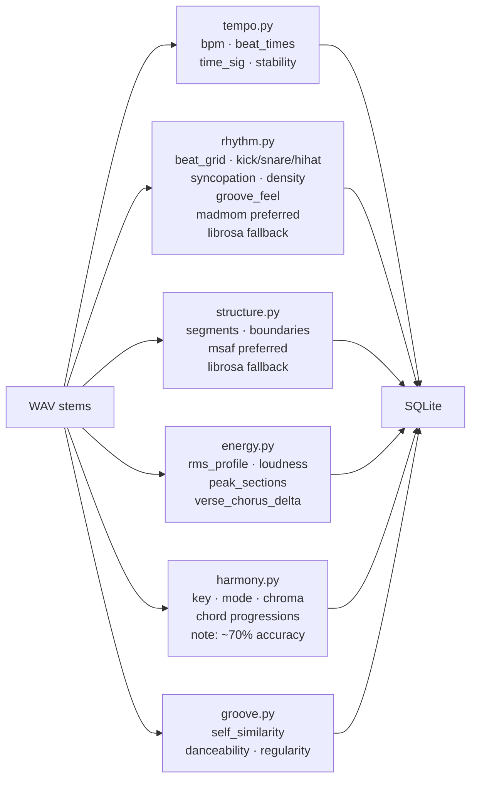
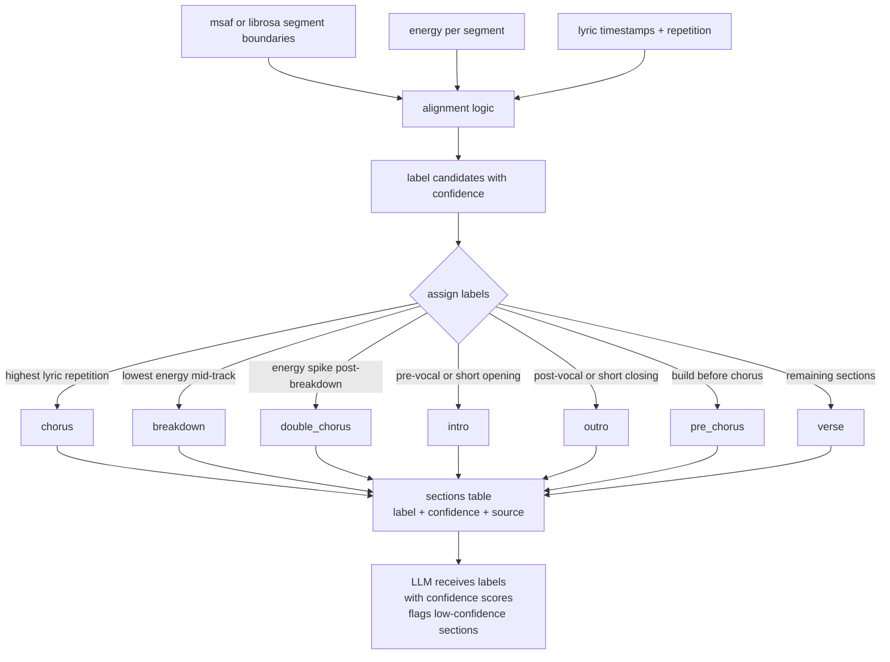
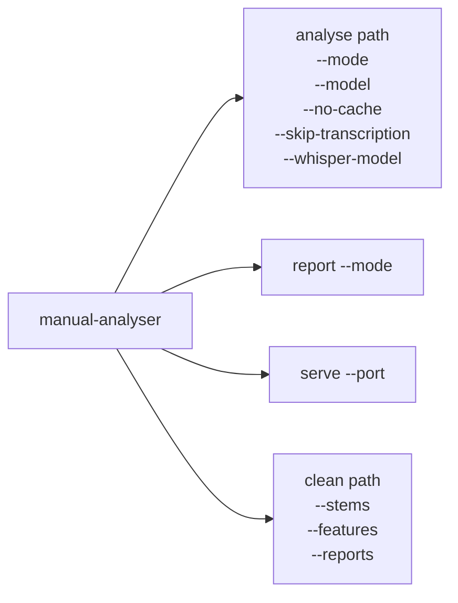
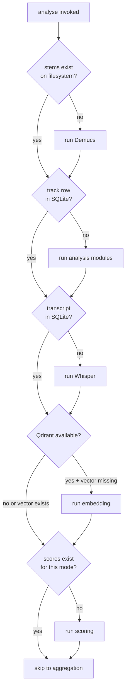

# Design Document

KLF Manual Analyser — architecture, decisions, and rationale.

This document is the authoritative reference for how the tool is built and why.
It is intended for contributors and for the author returning to the codebase after
time away.

---

## Table of Contents

1. [Goals](#goals)
2. [Non-goals](#non-goals)
3. [Language and runtime](#language-and-runtime)
4. [Dependency stack](#dependency-stack)
5. [Licensing](#licensing)
6. [Storage architecture](#storage-architecture)
7. [Architecture overview](#architecture-overview)
8. [Pipeline stages](#pipeline-stages)
9. [Hybrid structure detection](#hybrid-structure-detection)
10. [Project structure](#project-structure)
11. [File naming convention](#file-naming-convention)
12. [Criteria configuration schema](#criteria-configuration-schema)
13. [CLI design](#cli-design)
14. [Caching strategy](#caching-strategy)
15. [The three modes](#the-three-modes)
16. [Report design](#report-design)
17. [Test fixtures](#test-fixtures)
18. [Open questions](#open-questions)

---

## Goals

- Accept a folder of MP3s (target: ~40 tracks) and score each against the Golden
  Rules from *The Manual (How To Have A Number One The Easy Way)* by The KLF (1988)
- Score per criterion, not as a single aggregate score, so results are actionable
- Aggregate scores across all tracks to produce a "recipe" — a description of what
  a song would need to do to match the majority of the input set
- Produce an interactive HTML report browsable locally, with in-browser playback
  of full mix and individual stems
- Support three scoring modes: 1988, contemporary, and 1920s_1930s
- Be reproducible: anyone can clone the repo, bring their own MP3s, and run the
  full pipeline with a small number of install steps
- Run entirely locally; no audio data leaves the user's machine

---

## Non-goals

- Web deployment of any kind
- Real-time or streaming audio analysis
- Recommending specific commercial plugins, samples, or DAWs
- Predicting chart success
- Supporting formats other than MP3 at this stage

---

## Language and runtime

**Python 3.11+**, managed with **uv**.

The decision is driven by the MIR ecosystem. Every serious library — librosa,
essentia, madmom, msaf, Demucs, openai-whisper — targets Python first, and
several are Python-only. See README for alternatives considered.

**uv** is used in place of pip/venv: faster, correct lock files, better native
dependency resolution.

---

## Dependency stack

### Audio processing

| Library | Purpose | Licence | Compatibility risk |
|---|---|---|---|
| ffmpeg (system) | MP3 → WAV decode, normalisation | LGPL 2.1 / GPL 2+ | Low |
| librosa | BPM, chroma, energy, self-similarity, onset detection | ISC | Low |
| essentia | Danceability, groove descriptors | AGPL 3.0 | Medium |
| madmom | Beat grid, drum pattern detection, syncopation, groove feel | BSD 3-Clause | **High** |
| msaf | Structural segmentation (section boundaries) | MIT | **High** |

**madmom compatibility warning**: madmom's last release was 2019, officially
supporting up to Python 3.8. Python 3.11+ compatibility is not guaranteed.
Test installation before writing any code that depends on it. If madmom will
not install cleanly, groove feel detection and drum pattern analysis fall back
to librosa-based onset detection (less sophisticated but functional). See
fallback plan below.

**msaf compatibility warning**: msaf has not seen active development since
approximately 2017 and has known issues with newer librosa and scipy versions.
Test installation before writing `structure.py`. If msaf will not install,
structural segmentation falls back to `librosa.segment.agglomerative` — lower
accuracy but reliably available.

**Fallback plan — if madmom fails**:
- Groove feel: implement swing ratio from librosa onset envelope analysis
- Drum pattern: use librosa onset detection with frequency band separation
  (low = kick, mid = snare, high = cymbal) on the drums stem

**Fallback plan — if msaf fails**:
- Use `librosa.segment.agglomerative` with chroma and MFCC features
- Lower boundary accuracy; compensate with stronger lyric-based alignment

### Source separation

| Library | Purpose | Licence |
|---|---|---|
| demucs (htdemucs model) | Stem separation: drums / bass / vocals / other | MIT |

### Transcription

| Library | Purpose | Licence |
|---|---|---|
| openai-whisper (large-v3) | Vocals stem → transcript with timestamps | MIT |

### Storage

| Component | Purpose | Licence |
|---|---|---|
| SQLite (stdlib) | All structured feature data, scores, transcripts | Public domain |
| Qdrant (local) | Track similarity vectors — **optional** | Apache 2.0 |
| qdrant-client | Python client for Qdrant — **optional** | Apache 2.0 |

Qdrant is optional. If Qdrant is not running when `analyse` is invoked, the
embedding stage is skipped and a warning is emitted. All core functionality
(scoring, report, recipe) works without it. Similarity features in the report
(nearest neighbours, cluster view) are simply absent. This lowers the barrier
to first run for users who do not have Docker or a local Qdrant instance.

### LLM inference

| Component | Purpose | Licence |
|---|---|---|
| Ollama (system) | Local LLM runtime | MIT |
| qwen2.5:14b | Qualitative scoring, recipe synthesis | Qwen Licence |
| mistral-nemo:12b | Fallback if qwen unavailable | Apache 2.0 |
| nomic-embed-text | Feature summary embeddings for Qdrant (optional) | Apache 2.0 |

### CLI and reporting

| Library | Purpose | Licence |
|---|---|---|
| typer | CLI framework | MIT |
| rich | Terminal progress, formatted output | MIT |
| jinja2 | HTML report templating | BSD 3-Clause |
| tomllib (stdlib) | Criteria config parsing | PSF |

---

## Licensing

The tool itself is **MIT** licensed.

**Essentia (AGPL 3.0)**: AGPL requires source disclosure if software is run as
a networked service for third parties. This tool binds only to `localhost` and
its source is publicly available on GitHub. AGPL is no more restrictive than MIT
for this use case.

**Qwen model weights**: Alibaba's Qwen Licence explicitly permits non-commercial
and research/educational use. Users self-certify when running
`ollama pull qwen2.5:14b`.

Third-party licence texts are collected in `LICENSES/`.

---

## Storage architecture



**Why SQLite and not JSON files**: the feature data has natural relational
structure (tracks → sections → chords; tracks → scores), needs to support
aggregation queries across 40 tracks efficiently, and benefits from atomic
writes. JSON files require loading all data into memory to aggregate and have
no schema enforcement.

**Why Qdrant in addition**: track similarity queries require vector distance
operations that SQLite cannot perform. `nomic-embed-text` embeds a
human-readable feature summary per track into a 384-dim vector stored in
Qdrant. SQLite remains the source of truth; Qdrant is a derived, optional index.

**Why WAV files on the filesystem**: stems are binary, large, and served
directly as static files by the report server. Storing them in SQLite as blobs
would add complexity with no benefit.

**`rms_profile` storage**: stored as a JSON blob in the `tracks_timeseries`
table rather than in numpy format or separate files, keeping all data in one
database. Only read as a unit (never queried field-by-field), so the blob
approach is appropriate.

---

## Architecture overview



---

## Pipeline stages

### Stage 1: Decode

`src/manual_analyser/audio/decode.py`

Invokes ffmpeg as a subprocess. Mono WAV at 44100 Hz, normalised to -1 dBFS.
Written to `data/stems/{track_id}/full.wav`. Cached: skipped if output exists.

Also parses artist and song title from the filename at this stage and writes
the `tracks` row to SQLite.

### Stage 2: Separate

`src/manual_analyser/audio/separate.py`

Demucs (htdemucs). Uses CUDA if available. Produces `drums.wav`, `bass.wav`,
`vocals.wav`, `other.wav` under `data/stems/{track_id}/`. Cached: skipped if
all four stems exist. Slowest stage: ~10–30s per track on GPU.

### Stage 3: Analysis and transcription (parallel)

**Acoustic analysis** — `src/manual_analyser/analysis/`

Each module writes to SQLite directly. All modules are independent and can run
concurrently per track.



Chord detection accuracy note: automatic chord recognition on mixed audio is
approximately 70–75% accurate on modern recordings and significantly lower on
1920s material. Chord data should be treated as approximate throughout the
pipeline. LLM prompt hints for harmony criteria acknowledge this explicitly.

**Transcription** — `src/manual_analyser/transcription/whisper.py`

Runs on vocals stem. Writes `transcript_segments` rows and hook metadata to
the `tracks` table. Model: large-v3 (configurable).

### Stage 4: Hybrid structure alignment

`src/manual_analyser/analysis/structure.py` (alignment pass)

Reads segment boundaries, energy profile, and transcript timestamps from SQLite.
Cross-references all three to assign section labels with confidence scores.
Writes updated section labels back to the `sections` table.



### Stage 5: Embedding (optional)

`src/manual_analyser/embedding/embed.py`

Skipped silently if Qdrant is not reachable. When available: reads feature data
from SQLite, builds a human-readable text summary, sends to `nomic-embed-text`
via Ollama, stores resulting 384-dim vector in Qdrant.

### Stage 6: Scoring

`src/manual_analyser/scoring/`

Deterministic criteria (`threshold`, `range`, `exists`) evaluated directly from
SQLite without LLM calls. Qualitative criteria (`llm`) sent to Ollama with
constructed prompts. All scores written to the `scores` table.

### Stage 7: Aggregation

`src/manual_analyser/aggregation/aggregate.py`

SQL aggregation queries across all score, track, section, and beat pattern
tables. Optional Qdrant cluster query if available. Single LLM call for recipe
synthesis.

### Stage 8: Report

`src/manual_analyser/report/`

Jinja2 renders from SQLite query results. `server.py` is stdlib `http.server`
serving `data/reports/` and `data/stems/` at `localhost:8000`.

---

## Hybrid structure detection

Neither acoustic segmentation alone nor lyric analysis alone reliably labels
sections. The combination is significantly more robust:

- msaf/librosa gives boundaries but not labels
- Energy peaks suggest chorus candidates but can be fooled by loud verses
- Lyric repetition (same phrase across multiple segments) is a strong chorus signal
- Low energy + low lyric density + no repeated phrases = strong breakdown signal

Confidence scores reflect how many signals agree. A section labelled "chorus"
with high lyric repetition AND high energy AND msaf boundary agreement scores
0.9+. A section labelled by only one signal scores 0.5 or lower. The LLM is
explicitly given confidence scores and instructed to treat low-confidence labels
with scepticism.

---

## Project structure

```
klf-manual-analyser/
├── README.md
├── LICENSES/
│   ├── MIT.txt
│   ├── ISC.txt
│   ├── AGPL-3.0.txt
│   ├── BSD-3-Clause.txt
│   └── QWEN-LICENSE.txt
│
├── pyproject.toml
├── uv.lock
├── .python-version                 # 3.11
│
├── config/
│   ├── criteria_1988.toml
│   ├── criteria_contemporary.toml
│   └── criteria_1920s_1930s.toml
│
├── data/                           # gitignored
│   ├── stems/
│   ├── manual_analyser.db
│   └── reports/
│
├── src/
│   └── manual_analyser/
│       ├── __init__.py
│       ├── cli.py
│       ├── pipeline.py
│       ├── db.py                   # SQLite connection, schema, migrations
│       │
│       ├── audio/
│       │   ├── decode.py
│       │   └── separate.py
│       │
│       ├── analysis/
│       │   ├── tempo.py
│       │   ├── rhythm.py           # madmom preferred; librosa fallback
│       │   ├── structure.py        # msaf preferred; librosa fallback
│       │   ├── energy.py
│       │   ├── harmony.py
│       │   └── groove.py
│       │
│       ├── transcription/
│       │   └── whisper.py
│       │
│       ├── embedding/
│       │   ├── summarise.py        # builds text summary from DB features
│       │   └── embed.py            # nomic-embed-text + Qdrant write (optional)
│       │
│       ├── scoring/
│       │   ├── prompt.py
│       │   ├── llm.py
│       │   └── criteria.py
│       │
│       ├── aggregation/
│       │   └── aggregate.py
│       │
│       └── report/
│           ├── render.py
│           ├── server.py
│           └── templates/
│               ├── base.html
│               ├── track.html
│               └── summary.html
│
└── tests/
    ├── fixtures/
    │   └── SOURCES.md
    └── test_*.py
```

---

## File naming convention

MP3s must follow the format:

```
Artist_Name-Song_Title.mp3
```

Underscores separate words within artist name or song title. The hyphen separates
artist from title. The split is on the first hyphen only.

Examples:
```
The_KLF-Doctorin_The_Tardis.mp3
Stock_Aitken_Waterman-Never_Gonna_Give_You_Up.mp3
Louis_Armstrong-Heebie_Jeebies.mp3
Duke_Ellington-It_Dont_Mean_A_Thing.mp3
```

Parsing logic in `audio/decode.py`:
1. Strip `.mp3` extension
2. Split on first `-`
3. Replace `_` with space in each part
4. Title-case both parts
5. Store as `artist` and `song_name` in `tracks` table

Files that do not match the pattern are accepted but stored with `artist = null`
and `song_name = filename stem`, and a warning is emitted.

---

## Criteria configuration schema

Criteria are defined in TOML. Full field reference and per-mode definitions are
in `docs/CRITERIA.md`; this section documents the schema itself.

```toml
[mode]
name = "1988"
description = "KLF Manual Golden Rules, original 1988 edition"

[[criterion]]
id = "bpm"
name = "Tempo Ceiling"
description = "No song with a BPM over 135 will ever reach Number One."
weight = 1.5
db_field = "tracks.bpm"          # single field — scalar comparison
rule = "lte"
threshold = 135
unit = "BPM"
fail_message = "BPM exceeds the 135 ceiling. The Manual is clear on this."

[[criterion]]
id = "groove"
name = "Continuous Dance Groove"
description = "A single groove must run all the way through the record."
weight = 2.0
db_fields = [                    # multiple fields — all passed to LLM prompt
  "tracks.self_similarity_score",
  "tracks.beat_regularity",
  "tracks.danceability",
  "tracks.groove_consistency"
]
rule = "llm"
prompt_hint = "..."

[[criterion]]
id = "breakdown"
name = "Breakdown Section Present"
description = "A breakdown section must exist."
weight = 1.0
db_field = "sections.label"
rule = "exists"                  # boolean: does a row with this value exist?
value = "breakdown"
fail_message = "No breakdown section detected."
```

### Rule types

| Rule | Fields | Behaviour |
|---|---|---|
| `lte` | `db_field`, `threshold` | Pass if field ≤ threshold |
| `gte` | `db_field`, `threshold` | Pass if field ≥ threshold |
| `eq` | `db_field`, `threshold` | Pass if field == threshold |
| `range` | `db_field`, `threshold_min`, `threshold_max` | Pass if min ≤ field ≤ max |
| `exists` | `db_field`, `value` | Pass if any row has field == value for this track |
| `llm` | `db_field` or `db_fields`, `prompt_hint` | Routed to LLM; all field values passed as context |

`db_field` (singular string) is used for single-field criteria.
`db_fields` (array of strings) is used for multi-field criteria.
The two keys are mutually exclusive; `criteria.py` validates this at load time.

---

## CLI design



`clean` accepts an optional `path` argument matching what was passed to
`analyse`. If provided, only records derived from MP3s in that path are removed.
If omitted, all records are removed. This prevents accidental deletion of
analysis data from other input folders.

---

## Caching strategy



Track identity: MD5 of `path + filename`. `--no-cache` bypasses all checks.

---

## The three modes

### 1988 mode

Literal application of The Manual's criteria, calibrated to the late-1980s UK
singles market. Key thresholds:

- BPM ceiling: 135 (hard, deterministic)
- Intro length: 8–30 seconds (range rule)
- Structure: strict Manual template (includes breakdown and double chorus)
- Hook timing: title phrase expected within first 60 seconds
- Groove: relentless repetition is a virtue

LLM system prompt framed in the context of 1988 UK pop: Stock Aitken Waterman,
7" format, Top of the Pops, Gallup chart.

### Contemporary mode

Updated for the streaming era. Research basis:

- Intros now ~5 seconds; ceiling rule set at 15 seconds
- Hook timing: must arrive within 30 seconds (weight 1.5)
- Pop BPM: 118–128 (Spotify data); genre-contextual llm rule replaces hard ceiling
- Structure compressed; breakdown not required; pre-chorus positive signal
- Song length: still ≤ 210 seconds but 3' increasingly typical

### 1920s_1930s mode

Period-appropriate criteria for early jazz and dance band recordings. Key
differences from 1988 mode:

- Structure: 32-bar AABA or 12-bar blues form (not Manual template)
- Groove feel: `swung` is a positive signal (reversed from 1988/contemporary)
- BPM: dance-form appropriate (foxtrot 112–136, Charleston 180–220, blues 60–90)
- Duration: 78rpm format constraint (90–230 seconds)
- Chord detection caveat explicitly noted in all harmony prompt hints
- Whisper accuracy caveat noted in all lyric-dependent prompt hints

---

## Report design

Three views:

**Summary** — aggregate recipe, per-criterion pass rates, modal BPM/key/structure,
LLM recipe as a Manual-esque proclamation, ranked track list.

**Track list** — all tracks as cards, sortable by score or title.

**Track detail** — per-criterion scores with LLM reasoning; visualised energy
profile with labelled sections; beat pattern grid (kick/snare/hi-hat per bar);
full transcript aligned to sections; in-browser audio player.

**Audio player**: five sources per track (full mix, drums, bass, vocals, other),
switchable via tabs. Vanilla JS using the Web Audio API. Stems served as static
files by the local server. Playback position synced to section visualisation.

**Aesthetic**: punky and anarchistic — photocopied zine energy, bold typography,
deliberate visual chaos within a functional layout. Black, white, one aggressive
accent colour. Manifestos in ALL CAPS. The aggregate recipe as a proclamation.
The JS for the audio player will be hand-written; Jinja2 templates should leave
clear hooks (element IDs, data attributes) for it to attach to.

---

## Test fixtures

Public domain recordings from the 1920s–1930s. Sources:

- **Internet Archive** 78rpm collections — confirmed public domain, MP3 downloads
- **Open Music Archive** (openmusicarchive.org) — explicitly tagged public domain

Recordings from before 1928 are safe in both the US (Music Modernization Act)
and UK (70-year recording copyright from publication date). Full attribution in
`tests/fixtures/SOURCES.md`.

---

## Open questions

1. **Section labelling confidence algorithm** — the exact logic for deriving
   confidence scores from the combination of acoustic, energy, and lyric signals
   needs specifying. To be resolved during implementation of `structure.py`.

2. **LLM prompt templates** — full prompt templates (system prompt + user
   prompt structure) to be developed iteratively during implementation.

3. **JS audio player scope** — waveform visualisation, scrubbing, and section
   marker interactivity level to be decided during report implementation.
